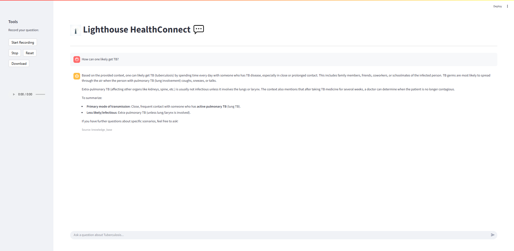

# Lighthouse HealthConnect:
Lighthouse HealthConnect: A multilingual chatbot, bridging gaps in knowledge, access, and language, to provide critical capacity building for healthcare providers and essential support for TB patients across Nigeria.


# Lighthouse HealthConnect 💬

Lighthouse HealthConnect is an intelligent, voice-enabled chatbot designed to provide accurate and reliable information about Tuberculosis (TB). It leverages a private knowledge base and can fall back to real-time web search to answer user queries, ensuring users receive helpful responses.



---

## ✨ Features

* **Conversational AI**: Ask questions in natural language and get informative answers.
* **Voice Input**: Use your voice to ask questions directly in the app.
* **RAG Pipeline**: Answers are primarily sourced from a curated knowledge base of trusted documents (**Retrieval-Augmented Generation**).
* **Web Search Fallback**: If the knowledge base doesn't have the answer, the application can search the internet to provide the best possible response.
* **Automatic Knowledge Base Updates**: The system automatically detects and processes updates to the knowledge base files.
* **Source Citing**: Know where your information comes from! The app indicates if an answer is from the knowledge base or a web search.

---

## 🛠️ Tech Stack

* **Frontend**: Streamlit
* **Backend**: Python
* **AI/ML**: LangChain, OpenAI/OpenRouter (for LLMs), Hugging Face (for embeddings)
* **Vector Database**: Pinecone
* **Speech-to-Text**: Google Speech Recognition via `SpeechRecognition`
* **Deployment**: Docker, Render

---

## 🚀 Getting Started

Follow these steps to set up and run the project locally.

### Prerequisites

* Python 3.9+
* API keys for:
    * OpenRouter
    * Pinecone
    * Hugging Face

### Installation & Setup

1.  **Clone the repository:**
    ```bash
    git clone https://github.com/AHFIDAILabs/WellBridgeBot.git
    cd WellBridgeBot
    ```

2.  **Install Python dependencies:**
    ```bash
    pip install -r requirements.txt
    ```

3.  **Set up environment variables:**
    * Create a file named `.env` in the root directory.
    * Copy the contents of `.env.example` (if available) or add the following keys:
    ```env
    OPENROUTER_API_KEY="your_openrouter_api_key"
    PINECONE_API_KEY="your_pinecone_api_key"
    PINECONE_REGION="your_pinecone_region"
    PINECONE_CLOUD="your_pinecone_cloud" # e.g., 'aws'
    HUGGINGFACE_API_TOKEN="your_huggingface_api_token"
    ```

4.  **Add your Knowledge Base:**
    * Place your knowledge base documents inside a single ZIP file (e.g., `TB_knowledge_base.zip`).
    * Put this ZIP file inside the `/data` directory. Supported file types are `.pdf`, `.txt`, and `.md`.

### Running the Application

1.  **Start the Streamlit app:**
    ```bash
    streamlit run main.py
    ```
2.  The first time you run the app with a new knowledge base, it will automatically process and embed the documents into Pinecone. This may take a few minutes.
3.  Open your web browser and navigate to the local URL provided by Streamlit (usually `http://localhost:8501`).

---

## 📁 Project Structure
wellbridgebot/
│
├── assets/
│   └── image.png, UI.png               # UI assets
├── data/
│   └── TB_knowledge_base.zip   # Your zipped knowledge base
├── modules/
│   ├── init.py
│   ├── audio_handler.py        # Speech-to-text and text-to-speech
│   ├── knowledge_base_manager.py # Loads and chunks documents
│   ├── llm_handler.py          # Manages LLM interaction and RAG chain
│   ├── utils.py                # Helper functions (hashing)
│   └── vector_store_manager.py # Manages Pinecone vector store
├── .env                        # Environment variables 
├── app.py                      # Core Streamlit UI and application logic
├── config.py                   # Loads environment variables
├── Dockerfile                  # Docker configuration
├── main.py                     # Main entry point
├── populate_kb.py              # Script to manually update the knowledge base
├── render.yaml                 # Deployment config for Render
└── requirements.txt            # Python dependencies