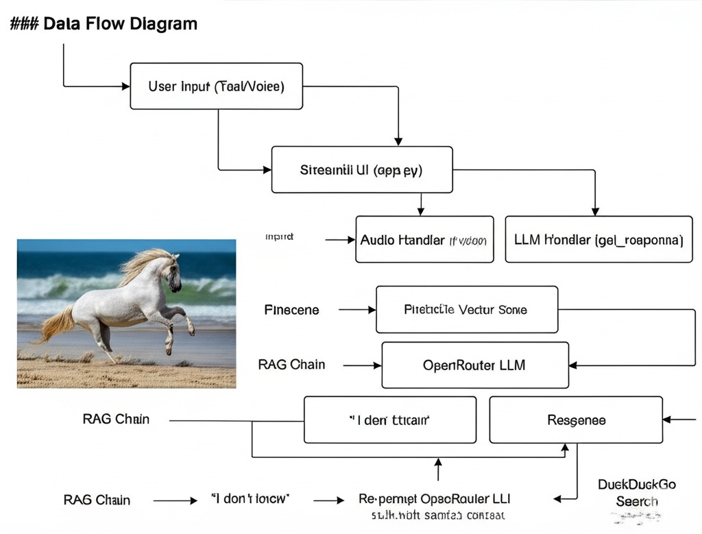

# Lighthouse HealthConnect - Technical Documentation

**Version:** 1.0
**Date:** July 28, 2025

## 1. Introduction

Lighthouse HealthConnect is an AI-powered conversational platform designed to provide accurate information on Tuberculosis (TB). It uses a Retrieval-Augmented Generation (RAG) architecture to query a specialized knowledge base, with a fallback mechanism to a public web search for comprehensive query handling. The system is built with a modular Python backend, a Streamlit-based user interface, and is containerized with Docker for easy deployment.

## 2. System Architecture

The application operates on a three-tiered architecture:

1.  **Frontend (UI Layer)**: A web interface built with **Streamlit** (`app.py`) that handles user interaction, including text and voice input.
2.  **Backend (Application Logic Layer)**: A set of Python modules that orchestrate the entire workflow, from data ingestion to response generation.
3.  **Data & Services Layer**: External services that provide core functionality, including:
    * **Pinecone**: A serverless vector database for storing and retrieving document embeddings.
    * **OpenRouter**: A service providing access to various Large Language Models (LLMs) like DeepSeek.
    * **Hugging Face**: Provides the sentence-transformer model for creating text embeddings.
    * **DuckDuckGo API**: Used for the web search fallback.

### Data Flow Diagram

`User Input (Text/Voice)` -> `Streamlit UI (app.py)` -> `Audio Handler (if voice)` -> `LLM Handler (get_response)` -> `Pinecone Vector Store` -> `RAG Chain` -> `OpenRouter LLM` -> `Response`

*If RAG fails:*
`RAG Chain` -> `"I don't know"` -> `LLM Handler` -> `DuckDuckGo Search` -> `Re-prompt OpenRouter LLM with search context` -> `Response`

---

## 3. Core Modules

### `llm_handler.py`
* **Purpose**: Manages all interactions with the LLM and the core RAG logic.
* **`get_llm()`**: Initializes and returns the LLM client configured for OpenRouter.
* **`get_qa_chain(vector_store)`**: Constructs the `RetrievalQA` chain from LangChain. It links the LLM, the vector store retriever, and a custom prompt template.
* **`search_internet(query)`**: Queries the DuckDuckGo API to fetch context for queries not found in the local KB.
* **`get_response(query, vector_store)`**: The main orchestration function. It first queries the RAG chain. If the response is low-confidence (contains "don't know") or returns no source documents, it triggers the `search_internet` fallback and re-queries the LLM with the new context.

### `vector_store_manager.py`
* **Purpose**: Handles all interactions with the Pinecone vector database.
* **`init_pinecone()`**: Initializes the Pinecone client and creates the specified index (`lighthouse-healthconnect`) if it doesn't already exist.
* **`get_vector_store()`**: Returns a queryable `LangchainPinecone` instance, which combines the Pinecone index with the Hugging Face embedding model.
* **`save_vector_store(documents)`**: Takes a list of LangChain `Document` objects, chunks them, generates embeddings, and upserts them into Pinecone in batches.

### `knowledge_base_manager.py`
* **Purpose**: Responsible for loading and preparing documents for the vector store.
* **`load_documents_from_zip(zip_file_path)`**: Extracts files (`.pdf`, `.txt`, `.md`) from a `.zip` archive into a temporary directory and loads them into memory using appropriate LangChain document loaders.
* **`chunk_documents(documents)`**: Uses a `RecursiveCharacterTextSplitter` to break down large documents into smaller, overlapping chunks suitable for embedding.

### `audio_handler.py`
* **Purpose**: Provides speech-to-text (STT) and text-to-speech (TTS) functionalities.
* **`speech_to_text(audio_file_path)`**: Uses the `SpeechRecognition` library to transcribe audio files via the Google Speech Recognition API.
* **`text_to_speech(text)`**: Uses `gTTS` (Google Text-to-Speech) to convert text responses into an MP3 audio file. *(Note: This is available but not currently implemented in the UI).*

---

## 4. Knowledge Base Update Process

The application features an automated process to update the vector store when the source knowledge base changes.

1.  **Hashing**: The `populate_kb.py` script and `app.py` use `utils.get_file_hash()` to compute a SHA256 hash of the `data/TB_knowledge_base.zip` file.
2.  **Comparison**: On startup, `app.py` compares the current file's hash with the hash stored in `last_kb_hash.txt`.
3.  **Update Trigger**: If the hashes do not match, it signifies that the knowledge base has been updated.
4.  **Execution**: The application runs the `populate_kb.py` script as a subprocess. This script loads the new documents, chunks them, and saves the new vectors to Pinecone, overwriting old data where necessary. Finally, it saves the new hash to `last_kb_hash.txt`.

---

## 5. Future Integration: WhatsApp

The application is designed for future integration with **WhatsApp**. The plan is to expose the core response generation logic via a REST API endpoint.

* **Mechanism**: A webhook will be set up using a service like Twilio. When a user sends a message to the designated WhatsApp number, Twilio will forward the message content to our API endpoint.
* **API Endpoint**: The endpoint will receive the user's query, pass it to the `llm_handler.get_response()` function, and return the generated text answer.
* **Response**: The backend will then format this text answer and send it back to the user via the Twilio WhatsApp API. Voice messages from WhatsApp will be routed through the `audio_handler` before processing.